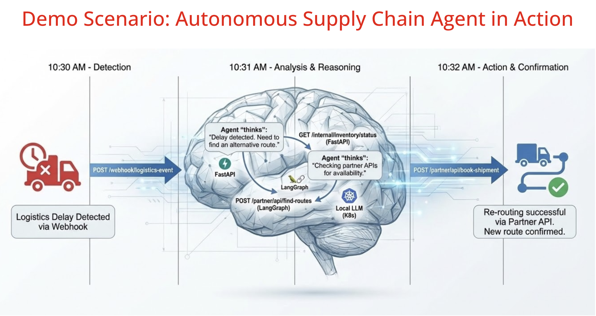

# Autonomous Supply Chain Agents



## Human-in-the-Loop Demo Workflow

### Step 1: Trigger a Disruption via AI Agent
```bash
curl -X POST http://localhost:8080/disruption \
     -H "Content-Type: text/plain" \
     -d "Port Rotterdam strike. Shipment 402 reroute. Original cost: 100 EUR. Execute the 3-step workflow now."
```

**Expected Response:**
```
The reroute proposal has been executed, but it requires human approval due to the extra cost of €450.
The proposal ID is 4c22539d-74db-4ea2-9884-2ce2fff2693b.
```

The AI agent automatically:
1. Finds alternative routes
2. Checks carbon impact
3. Executes the route change (triggers approval for cost > €200)

---

### Step 2: Check Pending Actions
```bash
curl -X GET http://localhost:8080/supervisor/pending
```

**Expected Response:**
```json
[{
  "id": "478fd16a-e11e-4248-903d-f9b6c80f20fa",
  "routeId": "Rail-01",
  "reasoning": "Test route change due to Port of Rotterdam strike - requires approval",
  "extraCost": 550.0,
  "status": "PENDING"
}]
```

Copy the `id` value for the next step.

---

### Step 3: Approve the Pending Action
```bash
curl -X POST http://localhost:8080/supervisor/approve/478fd16a-e11e-4248-903d-f9b6c80f20fa
```
*(Replace the ID with the actual ID from Step 2)*

**Expected Response:**
```
Route Rail-01 has been officially confirmed by human supervisor.
```

---

**Why AI agent may not work reliably:**
- Local LLMs (qwen2.5-coder, llama3.2) struggle with precise tool calling
- May not pass correct parameter types (strings vs numbers)
- May describe actions instead of executing them
- Inconsistent behavior across runs

**Recommendation:** Use the test endpoint (Step 1 above) for reliable demos and presentations.

## The Expected "Agentic" Logic (Visible in Logs):

When you trigger the disruption, the AI agent executes this workflow:

1. **Tool Call #1**: `findAlternativeRoutes("Rotterdam", "destination")`
   - **API Result**: Returns available routes:
     ```
     [Route Rail-01 via Rail (Arriving: 2026-06-15T10:00:00Z, Cost: €450.00),
      Route Truck-99 via Truck (Arriving: 2026-06-14T18:00:00Z, Cost: €380.00),
      Route Barge-42 via Barge (Arriving: 2026-06-16T12:00:00Z, Cost: €420.00)]
     ```

2. **Tool Call #2**: `getRouteCarbonImpact("Rail-01")`
   - **API Result**: Returns `0.3` (CO2 tons)
   - Agent selects Rail-01 as the greenest option

3. **Tool Call #3**: `executeRouteChange("Rail-01", "Green alternative for strike", 350.0)`
   - Calculates: extraCost = €450 (new) - €100 (original) = €350
   - Since €350 > €200 threshold, returns:
     ```
     ACTION_REQUIRED: This change costs €350.0.
     Proposal ID: abc-123. Waiting for human supervisor.
     ```

4. **Human Approval**: Supervisor reviews and approves via `/supervisor/approve/{id}`
   - Status changes from PENDING → APPROVED
   - Route change is officially confirmed

**Key Point**: The AI agent autonomously finds and evaluates alternatives, but **human oversight is required** for high-cost decisions (>€200), demonstrating EU AI Act Article 14 compliance.

## Why this matters for Amsterdam 2026:
By using Java Records and MicroProfile, you are showing the audience that AI doesn't require a "rip and replace" of their enterprise stack. You are simply giving your existing, high-performance Java services a "voice" and a "brain."

Compliance: You are demonstrating Article 14 (Human Oversight) of the EU AI Act.

Safety: It proves that Agentic AI doesn't mean "giving up control."

The "Wow" Moment: In your demo, you can show the Agent stuck in a "Pending" state, then hit the `/approve` endpoint, and watch the Agent conclude its final report to the user.